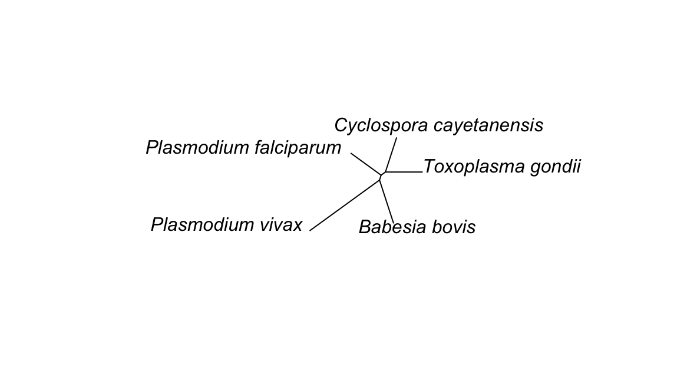

# PHYLOGENETIC TREE OF FIVE PROTISTS
#### Anela Selmic, BIO-410
###### Sequence finding of the cytochrome C gene from NCBI for Plasmodium falciparum, Plasmodium vivax, Toxoplasma gondii, Babesia bobis, and Cyclospora cayetanensis.
## Introduction
#### Plasmodium falciparum, Plasmodium vivax, Cyclospora cayetanensis, Toxoplasma gondii, and Babesia bovis are diverse parasites that are known for their impact on human and animal health. Plasmodium falciparum and Plasmodium vivax are known for causing different forms of malaria in humans, a major health issue in several tropical regions. While these two are similar, Plasmodium falciparum has some differences in how it affects people. Cyclospora cayetanensis leads to cyclosporiasis, which effects the stomach and gastrointestinal tract and is often in connection to contaminated food or water. Toxoplasma gondii contains a cause of toxoplasmosis, which affects a wide range of species including humans, and is often sourced through undercooked meat or contaminated soil. Babesia bovis is a parasite that causes babesiosis in cattle, and occasionally in humans, transmitted via ticks. With the use of NCBI, a scientific data base, I was able to gather organisms and gather sources in .png formats. Through the data base and formats, it aided in allowal for easy understanding of the complex relationships between these parasites.

## Methods
#### With the use of R studio, I was given the ability to analyze and create a phylogenetic tree based on finding a sequence of the cytochrome C gene from NCBI for the organisms. I began with a function to convert my sequences. I then used the "msa" function with the ClustalW method ('method = "ClustalW"') to perform multiple sequence alignment. ClustalW helped me with aligning multiple sequences, helping to identify regions of similarity that may provide evolutionary relationships among the sequences. After alignment, I subsetted the data for further analysis, preparing to construct a phylogenetic tree. With the use of the 'nj' function I was able to create a neighbor-joining tree from the distance matrix computed from the aligned sequences. Including commands such as ('plot(njtree)' and 'plot(njtree, type="unrooted") to plot in various forms and visualize the relationships among the organisms. The use of the 'ape' function also provided aid in performing the neighbor-joining.

## Figure 
###### 

## Results 
#### Plasmodium falciparum and Plasmodium vivax are placed closely together on the tree as they both belong to the genus Plasmodium and cause similar types of malaria in humans. Their closeness on the tree portrays their shared characteristics and similar impact on human health. On the other branches, Cyclospora cayetanensis, Toxoplasma gondii, and Babesia bovis are placed separately to indicate their distinct biological classifications and the various diseases they cause. Cyclospora cayetanensis causes cyclosporiasis, a disease distinct from malaria, affecting the gastrointestinal system and not related to the mosquito-borne transmission pattern of malaria. Toxoplasma gondii, known for causing toxoplasmosis, has a completely different life cycle and can infect almost all warm-blooded animals, making it quite distinct from the Plasmodium species. Babesia bovis affects primarily cattle and is a tick-borne parasite, which categorizes it differently both in terms of the host it infects and its method of transmission compared to the others. The tree depicts these relationships and differences, providing a visual representation of how these organisms are grouped based on shared attributes and the distinct diseases they cause, which also reflects their evolutionary relationships. The more similar they are, the closer together they appear on the tree. Likewise, the more distinct, the less related they are which is portrayed on the tree as further apart.
